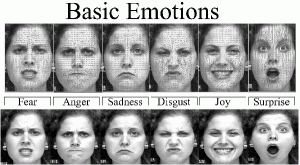

# Face-Emotion-Detection

  
 
 
  
## 🎇🎇Introduction:-
A repository of notebooks  with cnn for identifying different emotions in different combinations

## 🏁 Datasets Used:  

* FER2018 Dataset from kaggle. You can download from [here](https://www.kaggle.com/ashishpatel26/fer2018/download)
